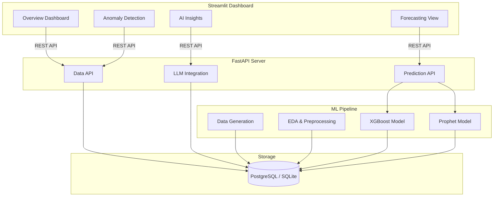

# 🚀 AI Revenue Forecasting Platform


An end-to-end AI-powered financial intelligence platform that provides revenue forecasting, anomaly detection, and natural-language insights using synthetic payment gateway data.

## 🌟 Key Features

- **Advanced Forecasting**: Utilizes XGBoost and Prophet for short-term and medium-term revenue predictions.
- **Anomaly Detection**: Automatically identifies revenue anomalies and irregular payment patterns.
- **Interactive Fintech Dashboard**: A professional, dynamic frontend built with Streamlit and Plotly.
- **Natural Language Insights**: Integrates OpenAI for automated textual insights and reporting on financial data.
- **Robust Backend API**: FastAPI-powered services to serve model predictions and handle database operations.

## 🏗️ Architecture



## 💻 Tech Stack

- **Frontend**: Streamlit, Plotly
- **Backend**: FastAPI, Uvicorn, Pydantic
- **Machine Learning**: XGBoost, Prophet, Scikit-learn, SHAP, Statsmodels
- **Data Engineering**: Pandas, NumPy, SQLAlchemy, Psycopg2
- **AI**: OpenAI API

## 🚀 Running Guide

### 1. Prerequisites
Ensure you have Python 3.10+ installed. It is recommended to use a virtual environment.

```bash
# Clone the repository
git clone https://github.com/rakeshrathod1411/razorpay-forecasting-portfolio.git
cd razorpay-forecasting-portfolio

# Create and activate virtual environment
python -m venv venv
source venv/bin/activate  # On Windows: venv\Scripts\activate

# Install dependencies
pip install -r requirements.txt
```

### 2. Setup Environment Variables 
Create a `.env` file in the root directory and add your credentials:
```env
OPENAI_API_KEY=your_openai_api_key_here
DATABASE_URL=sqlite:///./financial_data.db  # or your PostgreSQL URL
```

### 3. Data Generation & Database Setup
Run the data generation and database setup scripts to populate your local database with synthetic payment gateway data:
```bash
python src/modeling/database_setup.py
python src/modeling/generate.py
```

### 4. Model Training
Train the XGBoost and Prophet models on the generated data:
```bash
python src/modeling/train.py
```

### 5. Start the Backend API
Launch the FastAPI server to serve predictions and data:
```bash
cd src/backend
uvicorn api.main:app --reload --port 8000
```
*The API will be available at `http://localhost:8000`. You can view the interactive docs at `http://localhost:8000/docs`.*

### 6. Start the Frontend Dashboard
In a new terminal window, ensure your virtual environment is active and run the Streamlit app:
```bash
cd src/frontend
streamlit run app.py
```
*The dashboard will be available at `http://localhost:8501`.*

## 📄 License
This project is for portfolio purposes.

## 🤝 Author :
[Rakesh Rathod](https://github.com/rakeshrathod1411)
